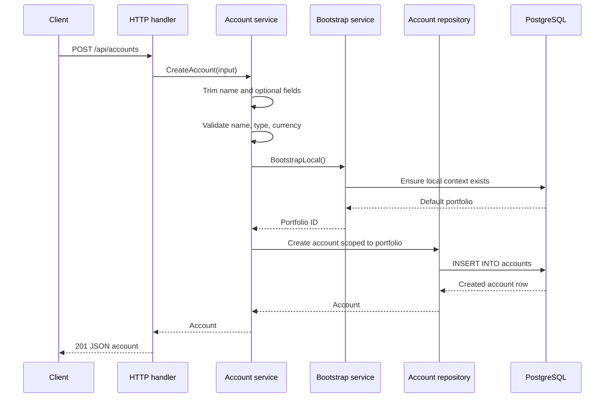
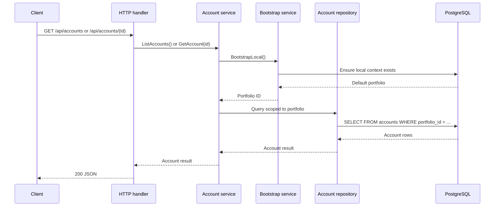

# Accounts

Accounts belong to the local default portfolio. The current API does not accept a portfolio ID from the request; each operation resolves the local bootstrap context first, then uses that portfolio ID for account reads and writes.

Endpoints:

- `POST /api/accounts`
- `GET /api/accounts`
- `GET /api/accounts/{id}`

Create flow:

Read flow:

Validation rules:

- `name` is required after trimming whitespace.
- `type` must be `BROKERAGE`, `BANK`, `CRYPTO_EXCHANGE`, `RETIREMENT`, or `MANUAL`.
- `base_currency` must be an uppercase 3-letter code.
- Account names are unique per portfolio, case-insensitive.

