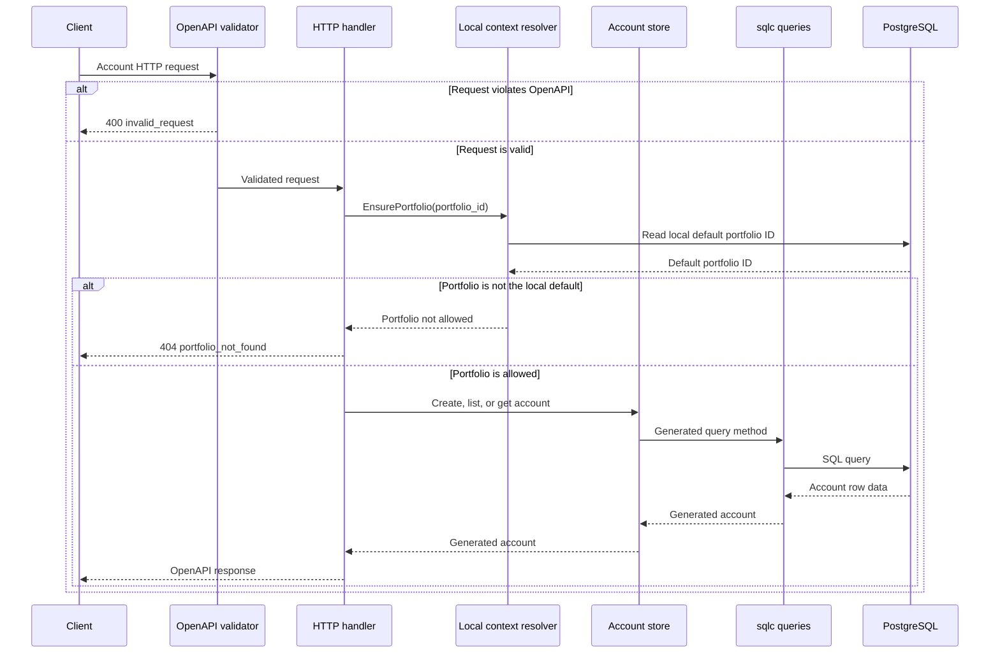

# Accounts

Accounts are scoped to a portfolio. In local deployment mode, the HTTP API reads the default portfolio ID from PostgreSQL for every account request and only allows that portfolio.

Canonical endpoints:

- `POST /api/portfolios/{portfolio_id}/accounts`
- `GET /api/portfolios/{portfolio_id}/accounts`
- `GET /api/portfolios/{portfolio_id}/accounts/{account_id}`

```mermaid
sequenceDiagram
    participant C as Client
    participant O as OpenAPI validator
    participant H as HTTP handler
    participant L as Local context resolver
    participant A as Account store
    participant Q as sqlc queries
    participant DB as PostgreSQL

    C->>O: Account HTTP request
    alt Request violates OpenAPI
        O-->>C: 400 invalid_request
    else Request is valid
        O->>H: Validated request
        H->>L: EnsurePortfolio(portfolio_id)
        L->>DB: Read local default portfolio ID
        DB-->>L: Default portfolio ID
        alt Portfolio is not the local default
            L-->>H: Portfolio not allowed
            H-->>C: 404 portfolio_not_found
        else Portfolio is allowed
            H->>A: Create, list, or get account
            A->>Q: Generated query method
            Q->>DB: SQL query
            DB-->>Q: Account row data
            Q-->>A: Generated account
            A-->>H: Generated account
            H-->>C: OpenAPI response
        end
    end
```

Validation rules:

- `name` is required and cannot start or end with whitespace.
- Optional text fields are either null or non-empty without surrounding whitespace.
- `type` must be `BROKERAGE`, `BANK`, `CRYPTO_EXCHANGE`, `RETIREMENT`, or `MANUAL`.
- `base_currency` must be an uppercase 3-letter code.
- Account names are unique per portfolio, case-insensitive.

OpenAPI middleware validates the HTTP contract. PostgreSQL constraints enforce the same persisted-data invariants. The account store calls generated sqlc queries directly and translates expected database errors.
