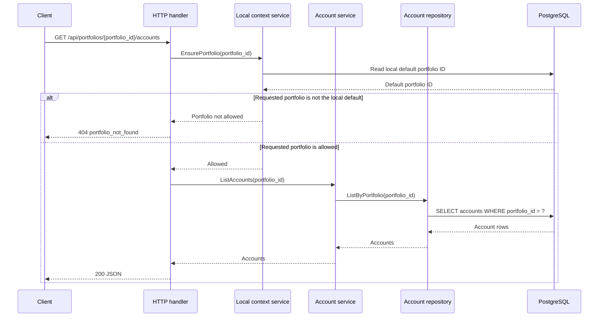

# Accounts

Accounts are scoped to a portfolio. In local deployment mode, the HTTP API reads the default portfolio ID from PostgreSQL for every account request and only allows that portfolio.

Canonical endpoints:

- `POST /api/portfolios/{portfolio_id}/accounts`
- `GET /api/portfolios/{portfolio_id}/accounts`
- `GET /api/portfolios/{portfolio_id}/accounts/{account_id}`

The unscoped `POST /api/accounts`, `GET /api/accounts`, and `GET /api/accounts/{id}` endpoints are temporary compatibility routes. They resolve the local default portfolio from PostgreSQL, then delegate to the same account service.

```mermaid
sequenceDiagram
    participant C as Client
    participant H as HTTP handler
    participant L as Local context service
    participant S as Account service
    participant R as Account repository
    participant DB as PostgreSQL

    C->>H: GET /api/portfolios/{portfolio_id}/accounts
    H->>L: EnsurePortfolio(portfolio_id)
    L->>DB: Read local default portfolio ID
    DB-->>L: Default portfolio ID
    alt Requested portfolio is not the local default
        L-->>H: Portfolio not allowed
        H-->>C: 404 portfolio_not_found
    else Requested portfolio is allowed
        L-->>H: Allowed
        H->>S: ListAccounts(portfolio_id)
        S->>R: ListByPortfolio(portfolio_id)
        R->>DB: SELECT accounts WHERE portfolio_id = ?
        DB-->>R: Account rows
        R-->>S: Accounts
        S-->>H: Accounts
        H-->>C: 200 JSON
    end
```

Validation rules:

- `name` is required after trimming whitespace.
- `type` must be `BROKERAGE`, `BANK`, `CRYPTO_EXCHANGE`, `RETIREMENT`, or `MANUAL`.
- `base_currency` must be an uppercase 3-letter code.
- Account names are unique per portfolio, case-insensitive.
