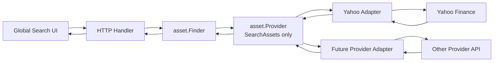

# Assets

Assets are Finsight's normalized representation of financial instruments. The backend keeps provider-specific data behind adapters and exposes provider-neutral asset candidates to the rest of the application.

The public HTTP implementation is search-only. It lets the UI find readable asset candidates through a market data provider. Internal source-of-truth workflows, including demo seeding, persist canonical asset rows through `asset.Store`; interactive search results are not persisted automatically.

## Core Idea

Finsight owns the internal asset shape. Providers only supply data that can be mapped into that shape.

The asset package separates four concerns:

- `asset.Finder`: validates application input and coordinates asset lookup.
- `asset.Provider`: provider-neutral interface for market data adapters.
- Provider adapters: translate external provider responses into Finsight candidates.
- `asset.Store`: normalizes durable asset input, calls generated sqlc queries directly, and returns generated asset rows.

The finder depends only on this interface:

```go
type Provider interface {
    SearchAssets(ctx context.Context, query string, limit int) ([]AssetCandidate, error)
}
```

Providers should return the richest normalized candidate data they can from their search implementation. For example, if a provider search response already includes currency, the adapter maps it directly. Missing optional fields such as `currency` may be returned as `nil`.

## Data Shape

`asset.AssetCandidate` is the normalized in-memory result used by the backend finder and HTTP adapter.

Fields:

- `Name`
- `Symbol`
- `Type`
- `Currency`
- `ProviderID`
- `ProviderSymbol`
- `Exchange`

`ProviderID` identifies the market data provider that produced the candidate. The first provider is `yahoo`.

`ProviderSymbol` stores the provider's identifier for the asset. It may match `Symbol`, but it should still be preserved separately because future providers may use different identifiers for price lookup.

## Provider Flow



The provider interface intentionally has one method. Provider-specific lookup steps, batching, caching, retries, or fallback behavior belong inside each adapter. The asset finder should not know whether a provider needed one external call or several.

## Current Yahoo Adapter

Yahoo search does not include every field Finsight wants to display. The Yahoo adapter currently calls Yahoo's public search endpoint directly, returns only the data available from symbol search, and leaves unavailable optional fields as `nil`.

1. Search Yahoo symbols.
2. Map Yahoo quote types into Finsight asset types.
3. Return normalized `asset.AssetCandidate` values.

The Yahoo HTTP request uses the incoming request context and an adapter-owned timeout so cancelled or slow searches do not keep the backend handler waiting indefinitely. If Yahoo symbol search fails, the whole provider call fails. Currency is currently returned as `nil` because this adapter does not call Yahoo's ticker detail endpoint.

Yahoo quote type mapping:

- `EQUITY` -> `EQUITY`
- `ETF` -> `ETF`
- `MUTUALFUND` -> `MUTUAL_FUND`
- `CRYPTOCURRENCY` -> `CRYPTO`
- anything else -> `OTHER`

## HTTP Boundary

Current endpoint:

- `GET /api/assets/search?q={query}&limit={limit}`

The HTTP response mirrors the provider-neutral candidate shape:

- `name`
- `symbol`
- `asset_type`
- `currency`
- `provider_id`
- `provider_symbol`
- `exchange`

Search input rules:

- `q` is trimmed and must be at least 2 characters.
- `limit` defaults to `10`.
- `limit` must be between `1` and `20`.

HTTP errors:

- `400 invalid_request`: the request does not match the OpenAPI contract.
- `502 asset_provider_unavailable`: provider lookup failed.
- `500 asset_search_failed`: unexpected backend failure.

## Adding Another Provider

To add a provider:

1. Add a new adapter in `apps/api/internal/asset`.
2. Implement `SearchAssets(ctx, query, limit) ([]AssetCandidate, error)`.
3. Map provider-specific instrument types into Finsight asset types:
   - `EQUITY`
   - `ETF`
   - `MUTUAL_FUND`
   - `CRYPTO`
   - `CASH`
   - `OTHER`
4. Set a stable lowercase `ProviderID`, such as `yahoo`, `alphavantage`, or `polygon`.
5. Preserve the provider's lookup identifier in `ProviderSymbol`.
6. Keep provider response structs and enum values inside the adapter.
7. Add adapter tests for type mapping, missing optional fields, and provider-specific fallback behavior.
8. Wire the adapter in `internal/app`, or add a composite provider if multiple providers should be active together.

For future multi-provider lookup, keep `asset.Finder` as the orchestration boundary. A composite provider can call several adapters, merge normalized candidates, and preserve each result's `ProviderID` and `ProviderSymbol` for later price lookups.

## Persistence Boundary

Asset lookup does not make financial data durable. Explicit source-of-truth workflows persist selected assets through `asset.Store`.

Provider candidates should become persisted assets only when a user confirms a source-of-truth workflow, such as import review. This keeps failed searches, abandoned imports, and incorrect provider matches out of the database.

When assets are persisted, the provider reference stored on the asset should come from the selected candidate:

- `provider_id`
- `provider_symbol`
- `symbol`
- `name`
- `asset_type`
- `currency`
- `exchange`
