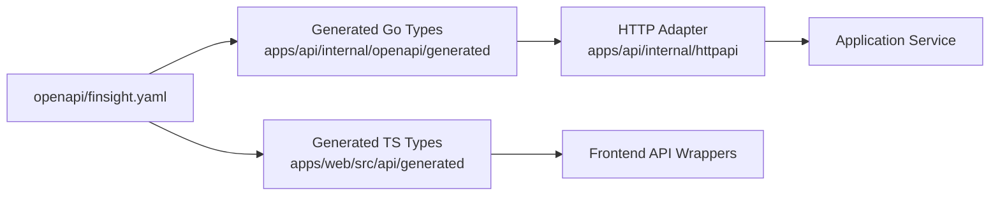

# API Guidelines

This document explains how to evolve the HTTP API. It complements [OpenAPI Workflow](openapi-workflow.md), [Backend Guidelines](backend-guidelines.md), and [Frontend Guidelines](frontend-guidelines.md).

## OpenAPI First

The HTTP API contract lives in `openapi/finsight.yaml`. It is the source of truth for paths, operations, request bodies, response bodies, status codes, and shared schemas.



When the API changes:

- Update `openapi/finsight.yaml`.
- Regenerate backend code with `cd apps/api && go generate ./...`.
- Regenerate frontend types with `pnpm -C apps/web openapi:gen`.
- Update handwritten handlers, services, frontend wrappers, and tests.

## Endpoint Design

Keep endpoints resource-oriented and explicit.

Guidance:

- Use stable nouns that match Finsight domain concepts.
- Keep request and response schemas clear rather than clever.
- Use specific operation IDs.
- Document all expected success and error statuses.
- Avoid exposing internal persistence details, provider-specific shapes, or generated database models.
- Prefer adding a focused endpoint over overloading one endpoint with unclear modes.

The API should support the frontend and future programmatic clients without becoming a place for business logic.

## Request And Response Shapes

Use OpenAPI schemas that are easy for Go and TypeScript to consume.

Rules:

- Keep required fields explicit.
- Use enums for closed sets that the frontend should render or validate.
- Use ISO currency codes as strings unless a stronger shared type is introduced deliberately.
- Use UUID strings for entity identifiers at the HTTP boundary.
- Use `date-time` and `date` formats where the distinction matters.
- Return domain-oriented responses, not database rows.

Do not leak generated sqlc types, pgx types, provider responses, or frontend-only view models into the API contract.

## Errors

Use the existing `ErrorResponse` shape unless a deliberate contract change is made:

```yaml
error:
  code: string
  message: string
```

Error guidance:

- Use stable machine-readable `code` values.
- Keep `message` useful for users and developers, but do not expose internal details.
- Translate expected service errors to appropriate HTTP status codes in `internal/httpapi`.
- Use `400` for invalid requests, `404` for missing resources, `409` for conflicts, and `500` for unexpected failures.
- Keep backend logs and wrapped errors useful without changing the public error contract.

## Handler Responsibilities

HTTP handlers should remain adapters.

Handlers should:

- Decode request bodies and path parameters.
- Call one or more application services.
- Map service outputs to generated OpenAPI response types.
- Translate known service errors to documented status codes.

Handlers should not:

- Contain financial business rules.
- Query PostgreSQL directly.
- Call market data providers directly.
- Use sqlc generated types as response models.
- Perform calculations that belong in services.

## Compatibility

During the MVP, favor simple explicit changes over complex versioning. When changing an existing API shape, update all generated code, handlers, frontend API wrappers, and tests in the same change.

Avoid breaking existing documented workflows unless the product and architecture docs are updated to reflect the new direction.
