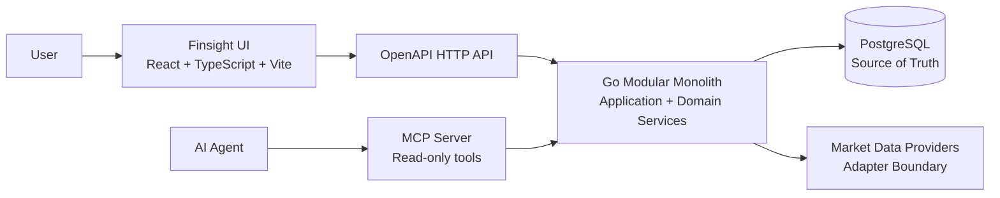
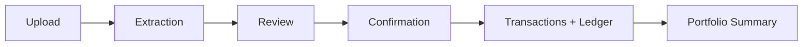
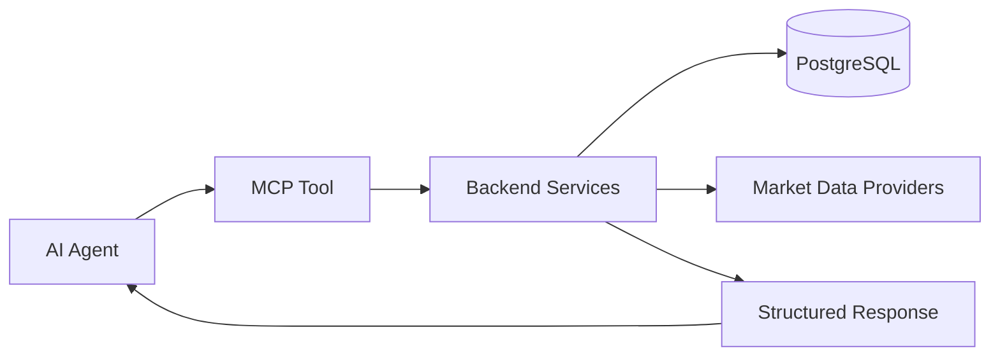
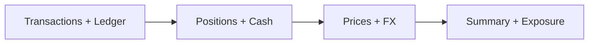

# Finsight Architecture

## 1. Purpose

Finsight is an open-source investment data platform for humans and AI agents.

This document describes the technical architecture for the MVP: the runtime components, their responsibilities, their communication paths, and the boundaries that keep the system simple enough to build as a modular monolith.

It should be read together with:

- [Vision](vision.md)
- [MVP](mvp.md)
- [Use Cases](use-cases.md)
- [Domain Model](domain-model.md)

This document does not define exact database tables, Go package names, token formats, file storage strategy, deployment infrastructure, or detailed frontend implementation patterns.

## 2. Architecture Principles

- Finsight is a modular monolith, not a microservices system.
- The backend is written in Go.
- The frontend is written in React, TypeScript, and Vite.
- PostgreSQL is the durable source of truth.
- The HTTP API is OpenAPI-first.
- MCP is the agent-facing interface.
- Transactions and ledger entries are the durable financial record.
- Portfolio summaries, positions, cash balances, and exposures are derived from source records.
- MCP tools are read-only in the MVP.
- External market data is isolated behind provider adapters.
- The same core application should support user-operated and managed deployment models.

## 3. High-Level Architecture

The React web app and MCP server are separate entry points into the same Go backend. They do not own business rules directly. Both call backend services that enforce workspace scoping, validation, financial rules, and persistence.

PostgreSQL stores source-of-truth records. Market data providers are external dependencies accessed through adapters that normalize provider-specific responses before they reach the core domain.

## 4. Runtime Components

### React Web App

The web app is built with React, TypeScript, and Vite.

It is responsible for presentation, UI state, forms, upload flows, review screens, and displaying backend responses. It talks only to the OpenAPI HTTP API and should use generated or typed API clients where useful.

The web app must not contain financial business rules. It may perform client-side validation for usability, but backend validation is authoritative.

Allowed dependencies:

- React app -> OpenAPI HTTP API.
- React app -> browser APIs needed for user interaction.

Disallowed dependencies:

- React app -> PostgreSQL.
- React app -> market data providers directly.
- React app -> MCP server.
- React app -> financial calculation logic that should live in the backend.

### Go Backend

The backend is a single Go modular monolith.

It exposes both the OpenAPI HTTP API and the MCP server. It owns business rules, validation, imports, transaction and ledger creation, portfolio calculations, market data normalization, authorization, and persistence.

The backend uses PostgreSQL as the source of truth. Runtime components should call backend application services rather than implementing their own access paths to the database or market data providers.

The backend should remain one deployable application for the MVP. Internal boundaries are logical boundaries inside the monolith, not separately deployed services.

### OpenAPI HTTP API

The HTTP API is the contract between the React web app and the Go backend.

It is mutation-capable for user workflows such as account management, imports, import review, and import confirmation. It is also used for read workflows such as portfolio summaries, positions, cash balances, and transaction history.

The OpenAPI contract should describe request and response shapes clearly enough for frontend development and future programmatic clients.

The HTTP API must call backend application services. It must not duplicate domain rules in handlers.

### MCP Server

The MCP server is the agent-facing interface.

In the MVP, MCP tools are read-only. They expose structured portfolio data to AI agents and call the same backend application services as the HTTP API.

The MCP server must not bypass authorization, workspace scoping, domain validation, or portfolio calculation rules. It must not support portfolio mutations, import confirmation, trading, broker synchronization, or financial advice actions.

### PostgreSQL

PostgreSQL is the durable source of truth.

It stores workspace, account, asset, listing, import, transaction, ledger entry, market price, FX rate, and connected-agent records. Derived data is computed from those source records.

Application code should access PostgreSQL through backend persistence boundaries. Frontend and MCP code should not query the database directly.

### Market Data Providers

Market data providers are external dependencies behind provider adapters.

Provider adapters translate provider-specific formats into Finsight concepts such as assets, listings, market prices, and FX rates. Provider-specific response shapes must not leak into the core domain model, HTTP API, MCP tools, or portfolio calculation logic.

Missing market prices or FX rates should produce incomplete-data warnings. They should not corrupt transactions, ledger entries, or portfolio state.

## 5. Internal Backend Boundaries

The backend should be organized around logical boundaries. These boundaries may become Go packages, but this document does not prescribe exact package names.

### Identity & Workspace

Owns user identity, workspace scoping, local-mode defaults, and the internal default portfolio used by the MVP.

Other backend areas may depend on this boundary to resolve the current workspace and authorization context.

### Accounts & Assets

Owns accounts, assets, listings, and asset/listing matching.

This boundary is responsible for keeping assets separate from market-specific listings so portfolios can contain instruments from multiple countries, exchanges, providers, and currencies.

### Imports

Owns upload intake, extraction orchestration, import item review state, validation status, and confirmation.

Imports target an account. The portfolio relationship is inferred through that account.

The import boundary may depend on accounts, assets, transactions, and market data. Other boundaries should not mutate import review state directly.

### Transactions & Ledger

Owns confirmed transactions and ledger entries.

This boundary converts confirmed user-reviewed data into durable financial records. It is the source for downstream portfolio calculations.

Other boundaries may read transactions and ledger entries, but only this boundary should create or modify them.

### Portfolio Calculation

Owns derived financial views such as positions, cash balances, allocations, exposure, and portfolio summary.

This boundary reads transactions, ledger entries, prices, and FX rates. It should not mutate source-of-truth transaction records as part of calculation.

### Market Data

Owns provider adapter integration, asset/listing lookup support, market prices, and FX rates.

This boundary hides provider-specific APIs and normalizes external data before persistence or calculation.

### MCP Tools

Owns MCP tool definitions and agent-facing response shaping.

This boundary calls backend application services for reads. It should not contain separate financial logic or direct database queries.

## 6. Data Flow

### Import Flow

Imports are account-scoped. Extraction creates reviewable import items. Confirmation creates transactions and ledger entries through backend services. Portfolio data is derived after confirmation.

### MCP Flow

MCP tools are read-only in the MVP. They call the same backend services as the HTTP API and return structured data suitable for agent reasoning.

### Portfolio Calculation Flow

Portfolio calculation starts from transactions and ledger entries. Positions and cash balances are derived first. Prices and FX rates are then applied when available to produce summaries and exposure views.

## 7. Deployment Models

### User-Operated Deployment

In a user-operated deployment, the user runs Finsight themselves.

This includes running Finsight on a local machine, home server, VPS, or on-premise infrastructure.

User-operated deployments use the open-source application, PostgreSQL as the source of truth, and the MCP interface for AI agents. They should not require a managed-service account.

### Managed Deployment

Finsight can also be operated as a managed service.

A managed deployment uses the same product architecture, domain model, OpenAPI contract, MCP contract, and transaction-first calculation model as user-operated deployments.

Operational choices such as hosting provider, authentication provider, monitoring, billing, and managed data providers are deployment-specific and intentionally not part of the open-source core architecture.

## 8. Technical Boundaries

- The React app may call only the OpenAPI HTTP API.
- The MCP server may call only backend application services.
- HTTP handlers and MCP tools must not duplicate financial rules.
- Only backend persistence boundaries may access PostgreSQL.
- Provider adapters must isolate external provider formats from the core domain.
- Market data can enrich portfolio views but must not become the source of truth for user transactions.
- Transactions and ledger entries are the source for portfolio calculations.
- Derived portfolio data must remain reproducible from source records.
- Workspace scoping and authorization must be enforced before returning user financial data.
- The MVP should stay within one backend application process.