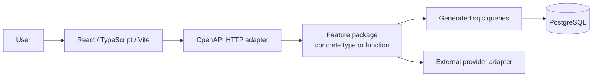

# Finsight Architecture

## Purpose

This document describes how Finsight is implemented today and the architectural constraints that govern the current codebase. Product requirements that are not yet implemented are defined in [MVP](mvp.md) and [Use Cases](use-cases.md); their internal architecture is intentionally left undefined until implementation work begins.

## System Overview

Finsight is a modular monolith with:

- A Go HTTP API.
- A React, TypeScript, and Vite web application.
- PostgreSQL for durable storage.
- An OpenAPI-first HTTP contract between the web application and API.
- sqlc-generated Go code for typed database access.
- Feature-oriented Go packages for application and financial behavior.
- Adapters for external market-data providers.

The currently running application has an HTTP entry point. Imports, MCP access, managed identity, and managed hosting infrastructure are not implemented runtime components.

```mermaid
flowchart LR
    User[User]
    Web[React / TypeScript / Vite]
    HTTP[OpenAPI HTTP adapter]
    Feature[Feature package<br/>concrete type or function]
    SQLC[Generated sqlc queries]
    Provider[External provider adapter]
    DB[(PostgreSQL)]

    User --> Web
    Web --> HTTP
    HTTP --> Feature
    Feature --> SQLC
    Feature --> Provider
    SQLC --> DB
```

## Runtime and Wiring

`cmd/finsight-api` loads configuration, constructs the application, starts the HTTP server, and closes resources during shutdown.

Application construction currently:

1. Opens a PostgreSQL connection pool.
2. Runs embedded Goose migrations before serving requests.
3. In local deployment mode, creates or reuses the local user, workspace, membership, and default portfolio.
4. Constructs local-context, account, asset-search, and portfolio-valuation dependencies.
5. Registers handwritten HTTP handlers behind generated OpenAPI interfaces and request validation middleware.

The configured `managed` deployment mode skips local bootstrap, but managed identity is not implemented; endpoints that require the current portfolio return a not-implemented error in that mode.

## HTTP and Frontend Boundaries

The OpenAPI specification in `openapi/finsight.yaml` is the contract used by the web application and Go HTTP API. It currently defines:

- Liveness and readiness checks.
- Local default-portfolio context.
- Account creation, listing, and lookup.
- Provider-backed asset search.
- Portfolio overview, daily value history, and account values.

Generated Go types and server interfaces remain at the HTTP boundary. Handwritten handlers parse transport data, verify the current local portfolio where required, call feature behavior, and translate results and errors into the OpenAPI response shapes.

The web application uses generated TypeScript OpenAPI types, `openapi-fetch`, and TanStack Query. Its portfolio page loads current value, value history, and account values from the API and supports account creation. Asset search also uses the API. The Imports, Agents, and Settings routes are placeholders.

## Backend Feature Packages

Backend behavior lives in focused packages under `apps/api/internal`:

- `app` and `startup` construct dependencies and run startup initialization.
- `bootstrap` and `localcontext` create and resolve the local default context.
- `account` implements account creation and reads using generated sqlc queries directly.
- `asset` implements provider-backed search and the current internal asset persistence behavior. The running HTTP application wires Yahoo search; search results are not persisted by that request.
- `transaction` validates and atomically persists transactions with their ledger entries. The package is implemented and tested but is not wired into the running application or current HTTP contract.
- `portfoliovalue` loads financial records and calculates portfolio overview, value history, account values, allocations, and incomplete-data warnings.
- `portfolio` contains the derived response concepts used by portfolio valuation.
- `httpapi` adapts the OpenAPI HTTP boundary to those features.
- `postgres` owns database setup, migrations, generated queries, and database conversions.

Dependencies flow from runtime adapters into the concrete feature type or function that owns the behavior, then to generated sqlc queries or an external-provider adapter.

## Persistence and Financial Calculations

PostgreSQL currently stores local identity and workspace context, portfolios, accounts, assets, transactions, ledger entries, market prices, and FX rates. Migrations and generated sqlc code are the authoritative description of that implemented data model; Markdown documentation does not duplicate every field.

Transactions and ledger entries are the durable financial records used by current valuation. Portfolio values are derived by:

1. Loading ledger entries for the requested portfolio through the valuation date.
2. Summing cash and asset quantities by account.
3. Applying the latest eligible market prices.
4. Converting values with available direct FX rates into the portfolio base currency.
5. Excluding values that cannot be priced or converted and returning warnings.

The value-history endpoint repeats that valuation for daily points in the requested range. It reports portfolio value over time, not investment returns.

The demo seed command supplies deterministic accounts, assets, transactions, ledger entries, prices, and FX rates for local development. It is not an import workflow.

## Provider Adapters

External market-data behavior is isolated in the `asset` package. The running application uses a Yahoo adapter for asset search and maps provider responses into provider-neutral candidates before they reach the HTTP response.

Provider-specific request and response details stay inside the adapter. Missing provider fields remain absent rather than being invented.

## Architectural Constraints

- Keep the backend as one deployable Go application unless an implemented change establishes a different architecture.
- Keep HTTP and frontend adapters thin; financial calculations and application rules belong to the concrete feature type or function that owns them.
- The frontend communicates with the backend through the current OpenAPI HTTP contract and does not access PostgreSQL or market-data providers directly.
- Generated OpenAPI and sqlc files are regenerated from their sources and are not edited manually.
- Feature code may call generated sqlc queries directly. A “persistence boundary” means persistence concerns stay out of HTTP and frontend code; it does not require repository or service layers.
- Prefer concrete feature types and functions. Do not introduce repository wrappers that only forward calls or map equivalent structures. Name types after their actual responsibility, such as `Store`, `Recorder`, `Calculator`, `Resolver`, or `Runner`.
- Market data enriches financial records but does not replace them. Missing data remains visible in the result.
- Technical documentation records implemented decisions. It does not reserve tables, packages, services, authorization mechanisms, or integration internals for future product requirements.
