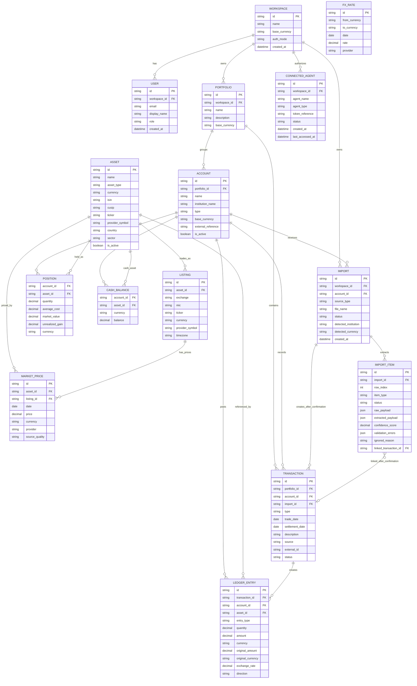

# Finsight Domain Model

## Overview

Finsight is a transaction-first investment data platform designed for both humans and AI agents.

The source of truth is financial transactions and ledger entries. Portfolio positions, cash balances, allocations, and performance metrics are derived from that history.

```text
Transactions
→ Ledger Entries
→ Positions & Cash Balances
→ Portfolio Summary
→ AI / MCP Tools
```

## Model Schema

This schema is a conceptual entity-relationship model for the MVP. It is intended to guide architecture and implementation; it is not yet a database migration.



### Relationship Notes

- `Workspace -> Portfolio -> Account` is the ownership path for MVP investment data. The MVP uses one default internal portfolio per workspace.
- `Import` belongs to a workspace and targets one account. The portfolio is inferred through the account.
- `Transaction` is the durable source of truth after import confirmation.
- `Ledger Entry` records normalized financial effects for a transaction and is used to derive positions, cash balances, allocations, and summaries. It can preserve original foreign-currency amounts and transaction exchange rates.
- `Position` and `Cash Balance` are derived models, not manually maintained records.
- `Listing` keeps assets usable across countries, exchanges, currencies, and market data providers.
- `Connected Agent` is read-only and workspace-scoped in the MVP.

## Design Principles

### Transaction-First

Transactions are the source of truth.

Holdings, positions, and cash balances are derived from transactions and should not be manually maintained.

### Multi-Currency by Design

Assets, accounts, and portfolios may use different currencies.

Exchange rates are first-class entities.

### AI-Native

The model supports AI-powered imports, MCP integrations, and audited agent access.

### Data Ownership

The same model must support:

- Cloud deployments
- Self-hosted deployments
- Local-only deployments

---

# Core Entities

## Workspace

Represents the owner of the data.

A workspace may represent:

- An individual investor
- A family
- A team
- An organization

### Fields

- id
- name
- base_currency
- auth_mode
- created_at

---

## User

Represents a human user.

### Fields

- id
- workspace_id
- email
- display_name
- role
- created_at

---

## Portfolio

Logical grouping of accounts.

The MVP requires a portfolio internally, but uses one default portfolio per workspace. Creating, editing, or switching portfolios is not user-facing in the MVP.

Examples:

- Personal Investments
- Retirement
- Crypto
- Company Treasury

### Fields

- id
- workspace_id
- name
- description
- base_currency

---

## Account

Represents where assets and cash are held.

Examples:

- Wealthsimple TFSA
- Interactive Brokers
- Binance
- French PEA
- Manual Account

Broker names are examples only unless explicitly listed as supported integrations.

### Fields

- id
- portfolio_id
- name
- institution_name
- type
- base_currency
- external_reference
- is_active

### Account Types

- BROKERAGE
- BANK
- CRYPTO_EXCHANGE
- RETIREMENT
- MANUAL

---

## Asset

Represents a financial instrument.

Examples:

- Apple Inc.
- XEQT
- Bitcoin
- CAD Cash
- USD Cash

### Fields

- id
- name
- asset_type
- currency
- isin
- cusip
- ticker
- provider_symbol
- country
- sector
- is_active

### Asset Types

- STOCK
- ETF
- FUND
- CRYPTO
- CASH
- BOND
- CUSTOM

### Notes

Cash is modeled as an asset with `asset_type = CASH`.

Examples:

- CAD
- USD
- EUR

---

## Listing

Represents where an asset trades.

Listings are useful for the France and Canada use case because the same financial instrument can have multiple tradable identities across exchanges, currencies, and providers. The asset represents the economic instrument; the listing represents the market-specific symbol used for prices, broker statements, and provider lookups.

Example:

Apple Inc.

- AAPL / NASDAQ / USD
- APC / XETRA / EUR

### Fields

- id
- asset_id
- exchange
- mic
- ticker
- currency
- provider_symbol
- timezone

### Notes

Finsight keeps `Listing` in the domain model even for the MVP because cross-country portfolios need stable identifiers for assets listed in different markets.

Examples:

- A Canadian ETF listed on TSX in CAD.
- A French ETF listed on Euronext Paris in EUR.
- A company with listings on multiple exchanges or currencies.
- A provider using a different symbol than the broker statement.

---

# Transactions

## Transaction

Represents a financial event.

### Fields

- id
- portfolio_id
- account_id
- type
- trade_date
- settlement_date
- description
- source
- import_id
- external_id
- status

### Transaction Types

- DEPOSIT
- WITHDRAWAL
- BUY
- SELL
- DIVIDEND
- INTEREST
- FEE
- TAX
- TRANSFER_IN
- TRANSFER_OUT
- FX_CONVERSION
- SPLIT
- OPENING_BALANCE
- ADJUSTMENT

---

## Ledger Entry

Represents the financial impact of a transaction.

Ledger entries are normalized financial effects used to derive positions, cash balances, allocations, and summaries. They are not a full double-entry accounting system unless that is explicitly added later.

### Example

Buy 10 AAPL for 1,000 USD with a 5 USD fee.

Ledger Entries:

- AAPL quantity +10
- USD cash -1,005
- Fee expense +5

### Fields

- id
- transaction_id
- account_id
- asset_id
- entry_type
- quantity
- amount
- currency
- original_amount
- original_currency
- exchange_rate
- direction

### Entry Types

- ASSET_QUANTITY
- CASH
- FEE
- TAX
- INCOME
- TRANSFER
- FX

### Notes

`amount` and `currency` represent the normalized amount used by Finsight for calculations. `original_amount`, `original_currency`, and `exchange_rate` preserve the broker or provider's original values when an imported transaction includes a foreign-currency conversion.

This keeps the transaction model simple while preserving enough detail for multi-currency portfolios, import auditing, and later performance calculations.

---

# Derived Models

## Position

Calculated from ledger entries.

### Fields

- account_id
- asset_id
- quantity
- average_cost
- market_value
- unrealized_gain
- currency

### Notes

Positions are derived and should not be treated as the source of truth.

---

## Cash Balance

Calculated from ledger entries.

### Fields

- account_id
- asset_id
- currency
- balance

### Notes

Cash balances are derived views grouped by account, cash asset, and currency. They should not be manually maintained.

---

# Market Data

## Market Price

Historical and current asset prices.

### Fields

- id
- asset_id
- listing_id
- date
- price
- currency
- provider
- source_quality

---

## FX Rate

Historical and current currency conversion rates.

### Fields

- id
- from_currency
- to_currency
- date
- rate
- provider

---

## Provider Strategy

Market data providers are not persisted as first-class domain entities in the MVP.

Provider integrations should be implemented as code-level adapters. Each deployment can configure its own provider adapter, and persisted market data records keep the provider name or code that supplied the value.

This keeps the domain model simple while allowing self-hosted users and organizations to bring their own market data providers later.

Provider adapters are responsible for:

- Searching assets
- Resolving listings and provider symbols
- Retrieving asset profiles
- Retrieving latest prices
- Retrieving historical prices
- Retrieving FX rates

Provider responses may use different identifiers, currencies, symbols, and payload shapes. Adapter code should normalize those responses into Finsight's `Asset`, `Listing`, `Market Price`, and `FX Rate` models before persistence.

---

# Imports

## Import

Represents a file or data source import.

### Fields

- id
- workspace_id
- account_id
- source_type
- file_name
- status
- detected_institution
- detected_currency
- created_at

### Source Types

- CSV
- XLSX
- PDF

### Future Source Types

The following source types are outside the MVP and should not drive the initial architecture:

- SCREENSHOT
- BROKER_EXPORT
- API
- MANUAL

---

## Import Item

Represents extracted data before becoming a transaction.

### Fields

- id
- import_id
- row_index
- item_type
- status
- raw_payload
- extracted_payload
- confidence_score
- validation_errors
- ignored_reason
- linked_transaction_id

### Item Types

- TRANSACTION
- ASSET
- LISTING
- MARKET_PRICE
- FX_RATE
- SKIPPED

### Statuses

- READY
- NEEDS_REVIEW
- IGNORED
- CONFIRMED
- ERROR

### Notes

`Import Item` preserves both the original extracted payload and the normalized candidate data. This is important for AI-assisted import review because the user needs to understand what was read, what Finsight inferred, and why a row needs attention.

`validation_errors` should be structured data, not a single string, so the UI and AI agents can explain missing assets, ambiguous listings, missing currencies, duplicate rows, or unsupported transaction types.

### Import Flow

```text
Upload File
→ Extraction
→ Import Items
→ User Review
→ Confirmation
→ Transactions
→ Ledger Entries
```

---

# AI & Security

## Connected Agent

Represents an AI agent connection that can call read-only MCP tools.

MVP agent access is workspace-scoped, token-based, read-only, and audited.

### Fields

- id
- workspace_id
- agent_name
- agent_type
- token_reference
- status
- created_at
- last_accessed_at

### Examples

ChatGPT:

- Read portfolio summary
- Read positions

Claude:

- Read portfolio summary
- Read transactions

Local LLM:

- Read portfolio summary
- Read positions
- Read transactions

### Future Fine-Grained Permissions

Fine-grained fields such as `allowed_tools`, `allowed_accounts`, and `allowed_data_scopes` are post-MVP and should not be required by the initial architecture.
