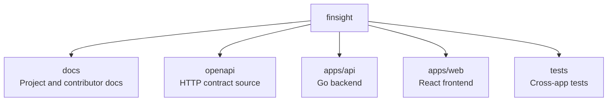
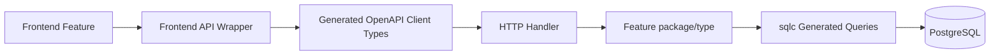

# Codebase Structure

This document maps the current repository layout and where new implementation work should live. It complements [Architecture](../architecture.md), [Database Guidelines](../guidelines/database-guidelines.md), and [OpenAPI Guidelines](../guidelines/openapi-guidelines.md).

## Repository Map

Primary areas:

- `docs`: product, architecture, and implementation documentation.
- `openapi/finsight.yaml`: source of truth for HTTP API contracts.
- `apps/api`: Go modular monolith backend.
- `apps/web`: React, TypeScript, and Vite frontend.
- `tests`: repository-level end-to-end test assets.

## Backend Layout

Backend code lives in `apps/api`.

Important areas:

- `cmd`: application entrypoints.
- `internal/<feature>`: focused feature packages and domain behavior such as `account`, `asset`, `bootstrap`, `localcontext`, `portfolio`, and `portfoliovalue`.
- `internal/httpapi`: handwritten HTTP adapters around generated OpenAPI interfaces.
- `internal/openapi/generated`: generated OpenAPI server/types code. Do not edit manually.
- `internal/postgres`: database setup, embedded migrations, and PostgreSQL support.
- `internal/postgres/queries`: sqlc query sources.
- `internal/postgres/generated`: generated sqlc code. Do not edit manually.
- `migrations`: Goose schema migrations.

New backend features should usually add or extend one feature package under `internal`, then connect it through `internal/httpapi` if HTTP access is needed.

## Frontend Layout

Frontend code lives in `apps/web`.

Important areas:

- `src/api`: API client setup, typed endpoint wrappers, and query/mutation hooks.
- `src/api/generated`: generated OpenAPI TypeScript types. Do not edit manually.
- `src/app`: app-level providers, router setup, and query client setup.
- `src/components/ui`: shared reusable UI primitives.
- `src/components/layout`: shared layout components.
- `src/features/<feature>`: feature-specific pages, tables, dialogs, charts, and tests.
- `src/i18n`: translation setup and resources.
- `src/routes`: route definitions.
- `src/routeTree.gen.ts`: generated TanStack Router tree. Do not edit manually.

New frontend features should usually live under `src/features/<feature>`, with API access in `src/api` when it is shared by that feature or route.

## Package Boundaries

Boundary rules:

- Feature UI should not know database details.
- HTTP handlers own transport parsing, authorization entry checks, DTO conversion, and HTTP error responses.
- Feature packages and concrete types own business workflows, database error translation, and transactions.
- Feature types and functions may use generated sqlc params and rows directly for table-shaped behavior.
- Create handwritten domain types only when the feature represents aggregates, calculations, or rules that differ from storage.
- Define small interfaces at the consuming package when they represent a meaningful capability that needs substitution; do not create them solely to mirror implementations or manufacture mocks.
- Generated files should be regenerated from their source inputs, not edited directly.

## Where To Add Tests

- Pure backend rules: package-level Go unit tests beside the feature.
- Backend HTTP behavior: tests in `apps/api/internal/httpapi`.
- SQL, constraints, transactions, and database error translation: PostgreSQL integration tests beside the feature.
- Frontend feature behavior: Vitest and Testing Library tests beside the feature UI code.
- Browser flows: Playwright tests when user workflows cross routing, API, or rendering boundaries.
