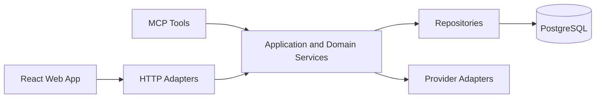
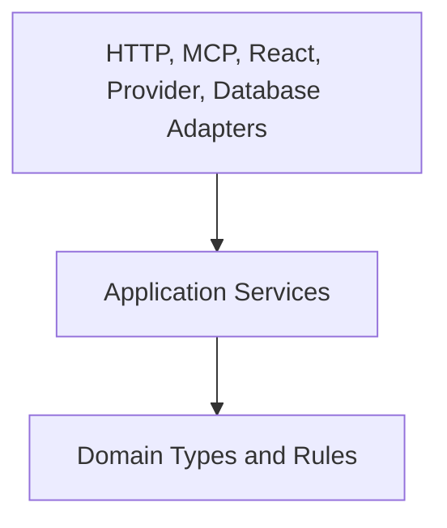
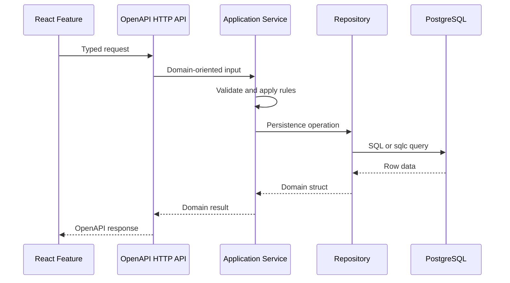

# Technical Direction

This document describes how the implementation should evolve. It does not replace the product, MVP, domain, or architecture sources of truth:

- [Architecture](../architecture.md)
- [Domain Model](../domain-model.md)
- [MVP](../mvp.md)
- [Use Cases](../use-cases.md)

## Stable Direction

Finsight should remain a modular monolith for the MVP. The backend is one Go application with clear internal boundaries, PostgreSQL is the durable source of truth, the React/Vite frontend talks through the OpenAPI HTTP API, and MCP is the read-only agent interface.

Stable decisions:

- Keep one deployable backend application unless the architecture docs change.
- Keep business logic in backend application/domain services.
- Keep HTTP handlers, MCP tools, repositories, and frontend components as adapters around the core behavior.
- Keep portfolio views derived from transactions, ledger entries, prices, and FX rates.
- Keep market data provider details behind provider adapters.
- Keep generated OpenAPI and sqlc types at the boundaries.
- Keep code explicit, readable, and testable before optimizing for abstraction.

## Dependency Direction

Dependencies should flow inward toward application and domain behavior. Boundary code may depend on services, but services should not depend on boundary-specific generated types or transport concerns.

Implementation consequences:

- HTTP handlers convert OpenAPI request types into service inputs.
- Repositories convert sqlc rows into domain structs.
- Provider adapters convert external market data into Finsight concepts.
- Frontend API wrappers convert generated client responses into feature-friendly hooks.
- Domain and application services should be straightforward to unit test without HTTP, React, or database setup.

## Request Flow

The normal mutation path should stay thin at the edges and explicit in the service layer.

## How New Features Should Grow

New features should start as the smallest complete vertical slice:

- Define or update the OpenAPI contract when the frontend or external clients need HTTP access.
- Add backend domain/application behavior before adding transport-specific behavior.
- Add persistence through migrations, sqlc queries, and repositories when durable state is required.
- Add frontend API wrappers and feature UI after the backend contract exists.
- Add tests at the service, adapter, and UI levels according to risk.

Prefer adding clear code to the current package structure over creating framework-like abstractions. Extract shared helpers only after repeated behavior is real and the extraction improves readability.
