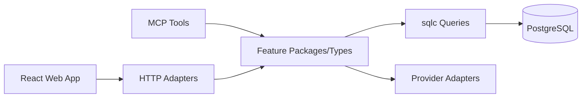
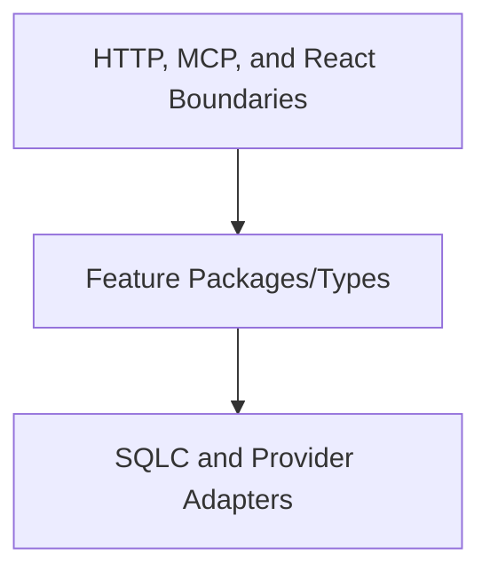
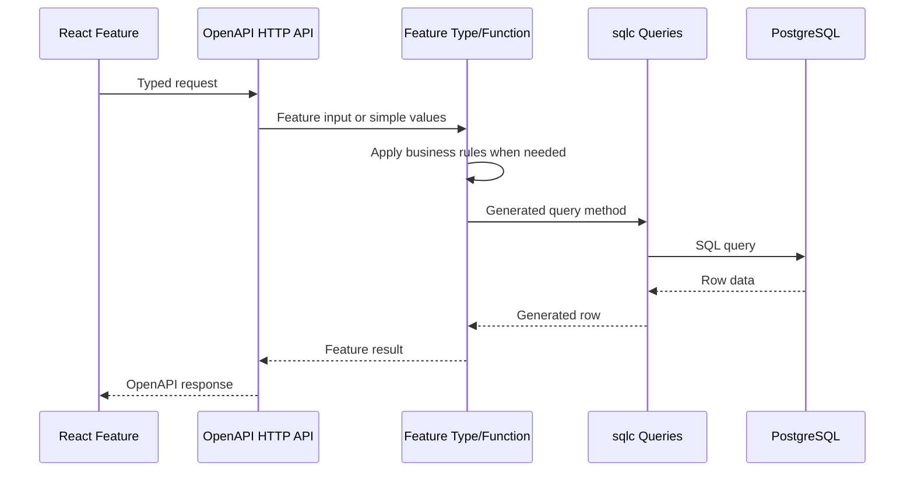

# Technical Direction

This document describes how the implementation should evolve. It does not replace the product, MVP, domain, or architecture sources of truth:

- [Architecture](../architecture.md)
- [Domain Model](../domain-model.md)
- [MVP](../mvp.md)
- [Use Cases](../use-cases.md)

## Stable Direction

Finsight should remain a modular monolith for the MVP. The backend is one Go application with clear internal boundaries, PostgreSQL is the durable source of truth, the React/Vite frontend talks through the OpenAPI HTTP API, and MCP is the read-only agent interface.

Stable decisions:

- Keep one deployable backend application unless the architecture docs change.
- Keep business logic in focused backend feature packages and concrete types/functions.
- Keep HTTP handlers, MCP tools, provider adapters, and frontend components thin around feature behavior.
- Keep portfolio views derived from transactions, ledger entries, prices, and FX rates.
- Keep market data provider details behind provider adapters.
- Use generated OpenAPI types at the HTTP boundary and generated sqlc types directly for table-shaped persistence.
- Keep code explicit, readable, and testable before optimizing for abstraction.

## Dependency Direction

Dependencies should flow from transport boundaries into focused feature behavior. Feature packages and concrete types may use generated sqlc types for table-shaped data, but they should not depend on generated OpenAPI types or transport concerns.

Implementation consequences:

- HTTP handlers convert OpenAPI request types into feature-owned inputs when a meaningful multi-field input exists; they pass simple identifiers directly. Feature types construct generated sqlc parameters internally.
- Table-shaped features may return generated sqlc rows without duplicating them as domain structs.
- Provider adapters convert external market data into Finsight concepts.
- Frontend API wrappers convert generated client responses into feature-friendly hooks.
- Handwritten domain models remain appropriate for aggregates, calculations, or behavior that differs materially from storage.

## Request Flow

The normal mutation path should stay thin, explicit, and close to the feature that owns it.

## How New Features Should Grow

New features should start as the smallest complete vertical slice:

- Define or update the OpenAPI contract when the frontend or external clients need HTTP access.
- Add focused backend feature behavior before adding transport-specific behavior.
- Add persistence through migrations and sqlc queries when durable state is required.
- Add frontend API wrappers and feature UI after the backend contract exists.
- Add pure unit, PostgreSQL integration, HTTP, and UI tests according to the behavior and risk.

Prefer adding clear code to the current package structure over creating framework-like abstractions. Extract shared helpers only after repeated behavior is real and the extraction improves readability.
