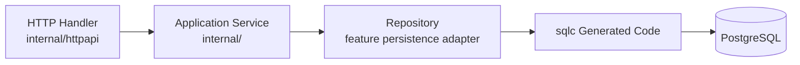

# Backend Guidelines

This document explains how to implement backend changes in the Go modular monolith. Read it with [Architecture](../architecture.md), [Database Guidelines](database-guidelines.md), and [OpenAPI Guidelines](openapi-guidelines.md).

## Layering

Backend layers should stay explicit and thin at the edges.



Responsibilities:

- Handlers decode requests, call services, map domain results to OpenAPI responses, and translate errors.
- Services validate inputs, enforce business rules, coordinate repositories, and return domain-oriented results.
- Repositories own persistence mapping and database error translation.
- sqlc generated code owns typed SQL access but should not leak into services.
- Migrations own schema changes.

## Feature Packages

Use feature packages under `apps/api/internal` for domain/application behavior. Existing examples include `account`, `identity`, `portfolio`, and `bootstrap`.

Package guidance:

- Define domain structs and service inputs in the feature package.
- Keep service constructors explicit about dependencies.
- Use narrow interfaces when a service needs another service or repository.
- Keep validation close to the service that owns the rule.
- Use sentinel errors for expected domain failures that adapters need to translate.
- Wrap unexpected errors with useful context.

Avoid large shared utility packages. Add shared helpers only when repeated behavior is real and the helper has a clear owner.

## HTTP Adapters

HTTP code lives in `apps/api/internal/httpapi`.

Handlers should:

- Use generated OpenAPI request and response types only at the HTTP boundary.
- Convert request values into service inputs.
- Convert service results into generated response types.
- Convert known service errors into documented HTTP status codes and `ErrorResponse` bodies.
- Avoid direct SQL, pgx, sqlc, migration, or provider logic.

Handlers should not enforce financial business rules beyond transport-level decoding and basic request handling. Backend services are authoritative.

## Persistence

PostgreSQL access should follow [Database Guidelines](database-guidelines.md).

Use:

- Goose migrations in `apps/api/migrations` for schema changes.
- sqlc query files in `apps/api/internal/postgres/queries` for non-trivial SQL.
- Repositories to adapt sqlc params and rows to domain types.
- Domain structs with typed values such as `uuid.UUID`.

Do not pass generated sqlc rows, pgx row types, or raw SQL details into services.

## Generated Code

Do not manually edit:

- `apps/api/internal/openapi/generated`
- `apps/api/internal/postgres/generated`

Regenerate from `apps/api` after OpenAPI, query, or schema changes:

```bash
go generate ./...
```

The repository uses pinned `go run ...@version` generator commands, so generator CLIs do not need to be added as runtime dependencies.

## Tests

Backend changes should include focused tests:

- Service tests for validation, business rules, and orchestration.
- HTTP tests for status codes, error bodies, and request/response mapping.
- Repository tests when database behavior, SQL mapping, or constraint translation is important.
- Migration tests when schema startup behavior is touched.

Run backend tests from `apps/api`:

```bash
go test ./...
```

For full repository checks, run:

```bash
make test
```
