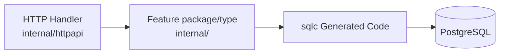

# Backend Guidelines

This document explains how to implement backend changes in the Go modular monolith. Read it with [Architecture](../architecture.md), [Database Guidelines](database-guidelines.md), and [OpenAPI Guidelines](openapi-guidelines.md).

## Layering

Backend request paths should use the fewest layers needed to express the behavior clearly.



Responsibilities:

- OpenAPI middleware validates the HTTP contract before handlers run.
- Handlers decode requests, enforce the transport authorization entry point, map DTOs, and translate errors.
- Concrete feature types and functions construct generated sqlc parameters, call sqlc directly, enforce business workflows, own transactions, and translate database errors.
- Use a feature-owned input struct when an operation has several related fields, such as account creation. For one or two simple identifiers, pass arguments directly instead of introducing a wrapper params type.
- Migrations own schema changes.

## Feature Packages

Use feature packages under `apps/api/internal` for domain/application behavior. Existing examples include `account`, `asset`, `bootstrap`, `localcontext`, `portfolio`, and `portfoliovalue`.

Package guidance:

- Prefer a concrete type or function with explicit dependencies.
- Do not create feature or domain structs that merely copy generated sqlc rows. Feature-owned input structs are appropriate when they express a meaningful multi-field operation using transport- and database-independent Go types.
- Define domain structs when representing aggregates, calculations, derived values, or rules that differ from the database shape.
- Define small interfaces at the consuming package when they represent a meaningful capability that needs substitution.
- Do not create interfaces that merely mirror concrete implementations or manufacture mock seams for tests.
- Let OpenAPI own transport-shape validation and PostgreSQL constraints own persisted-data integrity.
- Use sentinel errors for expected domain failures that adapters need to translate.
- Wrap unexpected errors with useful context.

Avoid large shared utility packages. Add shared helpers only when repeated behavior is real and the helper has a clear owner.

## Go File Naming

When creating or renaming Go files:

- Use short, lowercase, descriptive filenames based on the concrete responsibility or concept implemented in the file.
- Prefer domain or behavior names such as `store.go`, `validation.go`, `errors.go`, `handler.go`, `parser.go`, `client.go`, or `account.go`.
- Avoid generic catch-all filenames such as `component.go`, `service.go`, `manager.go`, `utils.go`, `helpers.go`, `common.go`, or `misc.go` unless that term genuinely represents a well-defined concept in the codebase.
- Do not repeat the package name unnecessarily. Inside package `account`, prefer `store.go` over `account_store.go`.
- A file should normally have one cohesive responsibility. If no precise filename describes everything in the file, consider splitting the file rather than choosing a broader filename.
- Name the file according to what a developer would expect to find inside it when browsing the directory, not according to an architectural layer imported from another ecosystem.
- Do not assume every package needs a central or "main" file or type. Create structs only when they naturally group shared state, dependencies, or behavior.

## HTTP Adapters

HTTP code lives in `apps/api/internal/httpapi`.

Handlers should:

- Use generated OpenAPI request and response types only at the HTTP boundary.
- Convert request values into feature-owned input types when the operation has a meaningful multi-field input. Pass small values such as IDs directly. Keep generated sqlc parameter construction inside the feature type or function.
- Convert feature results into generated response types.
- Convert known feature errors into documented HTTP status codes and `ErrorResponse` bodies.
- Never place raw SQL or migration logic in handlers.

Handlers should not enforce financial business rules. Feature types/functions and PostgreSQL constraints are authoritative.

## Persistence

PostgreSQL access should follow [Database Guidelines](database-guidelines.md).

Use:

- Goose migrations in `apps/api/migrations` for schema changes.
- sqlc query files in `apps/api/internal/postgres/queries` for non-trivial SQL.
- Concrete feature types and functions that call generated sqlc methods directly.
- Handwritten domain structs only when their meaning differs from a table row.

Keep SQL in dedicated migration and query files. Do not introduce repository wrappers that only forward calls or map equivalent structures.

## Generated Code

Do not manually edit:

- `apps/api/internal/openapi/generated`
- `apps/api/internal/postgres/generated`

Regenerate from `apps/api` after OpenAPI, query, or schema changes:

```bash
go generate ./...
```

The repository uses pinned `go run ...@version` generator commands, so generator CLIs do not need to be added as runtime dependencies.

## Tests

Backend changes should include focused tests:

- Pure unit tests for validation, normalization, calculations, and other deterministic behavior.
- HTTP tests for status codes, error bodies, and request/response mapping.
- PostgreSQL integration tests for sqlc queries, constraints, mappings, error translation, and transactions.
- Small fakes only for meaningful external boundaries.
- Migration tests when schema startup behavior is touched.

Run backend tests from `apps/api`:

```bash
go test ./...
```

For full repository checks, run:

```bash
make test
```
