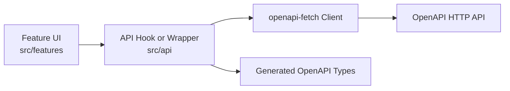

# Frontend Guidelines

This document explains how to modify the current React/Vite application. Read it with [Architecture](../architecture.md) and [OpenAPI Guidelines](openapi-guidelines.md).

## Frontend Boundary

The frontend is responsible for presentation, interaction, forms, loading states, and user workflow. It must not own financial business rules or access backend dependencies directly.



Frontend code may:

- Call the OpenAPI HTTP API.
- Use generated OpenAPI types.
- Use client-side validation for usability.
- Format data for display.

Frontend code must not:

- Query PostgreSQL.
- Call market data providers directly.
- Reimplement authoritative financial calculations.
- Depend on provider-specific backend internals.

## Feature Organization

Place feature-specific UI under `apps/web/src/features/<feature>`.

Use:

- `src/api` for endpoint wrappers, query keys, and TanStack Query hooks.
- `src/components/ui` for shared primitives that are reusable across features.
- `src/components/layout` for app-level layout components.
- `src/i18n/resources` for user-facing text.
- `src/routes` for route files.

Keep feature components close to their tests. Extract shared components only when multiple features need the same behavior.

Do not reserve frontend feature folders or state models for unimplemented capabilities. Decide their ownership when implementing the user journey.

## Server State

Use TanStack Query for server state:

- Queries own loading, error, and refetch behavior.
- Mutations own writes and invalidation.
- Query keys should be stable and exported when reused.
- Avoid duplicating server data into local component state unless the user is editing a draft.

Local component state is appropriate for open dialogs, form drafts, selected tabs, and other UI-only state.

## API Types

Generated TypeScript API types live in `apps/web/src/api/generated` and must not be edited manually.

After changing `openapi/finsight.yaml`, regenerate frontend types:

```bash
pnpm -C apps/web openapi:gen
```

Prefer deriving request, response, and enum types from generated OpenAPI types instead of duplicating string unions in feature code.

## Forms, Text, and UI

- Use existing UI primitives before creating new ones.
- Keep forms explicit and accessible.
- Put user-facing strings in i18n resources.
- Keep API payload values aligned with backend-defined OpenAPI values.
- Show clear loading, empty, and error states for server-backed screens.
- Keep temporary placeholder behavior explicit and isolated from implemented features.

Client validation improves usability, but backend validation remains authoritative.

## Tests

Frontend changes should include tests proportional to risk:

- Feature tests with Vitest and Testing Library for visible behavior.
- API wrapper tests when error handling or data mapping is non-trivial.
- Playwright tests for important end-to-end workflows.

Useful commands:

```bash
pnpm -C apps/web typecheck
pnpm -C apps/web test
pnpm -C apps/web build
pnpm -C apps/web test:e2e
```
